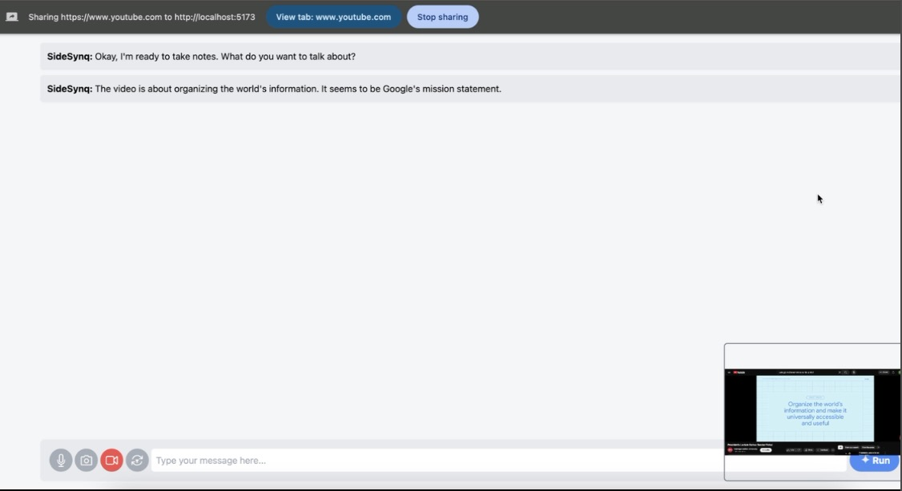

# SideSynq: Your Real-Time Gemini Based Multimodal AI Assistant

SideSynq is a real-time AI assistant showcasing the capabilities of Google's Gemini multimodal live API.  It allows users to interact with Gemini using text, audio, and video

## Features

*   **Multimodal Input:** Send messages to the AI using text, audio (microphone), or video (camera and screen sharing).
*   **Multimodal Output:** Receive responses in either text or audio format.
*   **Real-time Interaction:** Experience a dynamic and responsive conversation flow thanks to the WebSocket-based communication.





## Prerequisites

*   **Node.js and npm:** For managing frontend dependencies and running the development server.
*   **Python 3.8+:** For running the backend server.
*   **Google Cloud Account:** You'll need a Google Cloud project with the AI Platform API enabled.
*   **Environment Variables:** Rename `.env_template` to `.env` file in the `backend` directory and add your Google Cloud project ID and Gemini model ID:

```
PROJECT_ID=your-gcp-project-id
MODEL_ID="gemini-2.0-flash-exp"
```

## Installation

1. **Clone the repository:**

```bash
git clone https://github.com/krishnaji/sidesynq.git
cd sidesynq
```

2. **Install frontend dependencies:**

```bash
cd frontend
npm install
```

3. **Install backend dependencies:**

```bash
cd ../backend
pip install -r requirements.txt
```

## Running the Application

1. **Start the backend server:**

```bash
cd backend
uvicorn main:app --reload --host 0.0.0.0 --port 8000
```

2. **Start the frontend development server:**

```bash
cd ../frontend
npm run dev
```

3. **Access the application:**

Open your web browser and go to `http://localhost:5173` (or the port specified by the Vite development server).

## Usage

1. **System Instructions:**
    *   Click on the "System Instructions" header to expand the section.
    *   Enter your desired instructions to guide the AI's behavior.
    *   Choose the "Response Modality" (Text or Audio).
    *   Minimize the section to apply the changes.

2. **Inputs:**
    *   **Text:** Type your message in the input box and press Enter or click the "Run" button.
    *   **Audio:** Click the microphone icon to start recording. Click it again to stop and send the audio.
    *   **Camera:** Click the camera icon to activate your webcam. Click it again to stop.
    *   **Video:** Click the video icon to start screen sharing. A pop-up will allow you to choose what to share. Click the icon again to stop.
    *   **Periodic Text:** Click the "T" icon to configure a periodic text message. Enter the text and frequency (in seconds) in the modal. Click "Done" to start. Click the icon again to stop sending.


 
